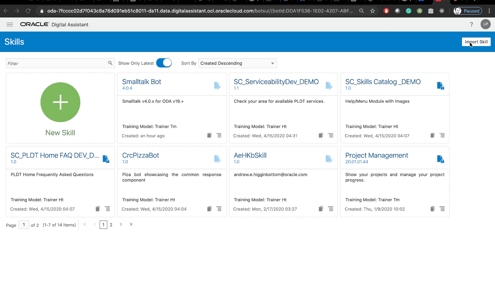
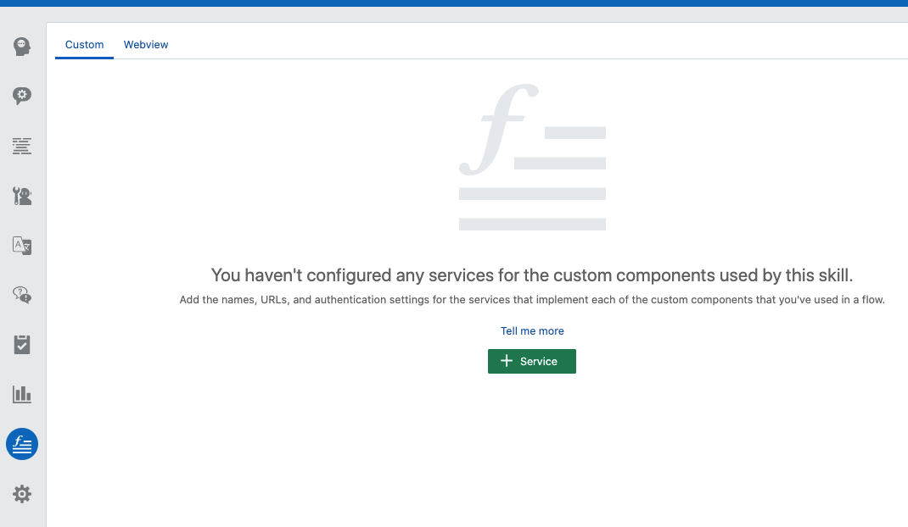

# Digital Assistant Smalltalk Skill and Custom Component

Copyright (c) 2020, Oracle and/or its affiliates.

## Prerequisites

* To run the SmallTalk Bot you would require Oracle Digital Assistant version 19.+
* [Nodejs](https://nodejs.org/) installed on your machine. Oracle provides [Node.js binaries for Oracle Linux](https://yum.oracle.com/oracle-linux-nodejs.html) or you can install Node.js from upstream
* [The Oracle Bots Node SDK](https://github.com/oracle/bots-node-sdk)

## Docs

* [Supported Bot Intents](docs/bot-intents.md)
* [Chat Example](docs/demo-scripts.md)  
* [Use With Digital Assistant Routing](docs/smtlk-da-routing-usage.md)
* [Use in YAML](docs/smtlk-yaml-usage.md)

## Installation

To be able to test the Smalltalk bot you would need to install and run the custom component, which is provided as part of this repository. You can run the custom component in 2 ways:

* Locally on your machine, in case you want to debug it or extend it
* Into the Oracle Digital Assistant Embedded Container

## Import Oracle Digital Assistant Skill

The easiest way to install and test the bot is to deploy the exported Oracle Digital Assistant skill from the [resources](resources/) folder.

Open your ODA instance 19.x+ version, preferable 20.x+ and use the `Import Skill` button to import the skill under `resources/x.x.x` version folder. The version under the resource folder points to the version of the Smalltalk Bot and it is not related to the ODA version required. All Smalltalk bots versions 4+ would work with the latest Oracle Digital Assistant. The ODA ZIP file with the skill contains all the intents and configurations required to run the bot, with the exception of the custom component that would be required. To import the skill do the following:

* Go to your Oracle Digital Assistant instance
* On the top right click the `Import Skill` button
* From the newly openede window go to the the location, where you checkout the code and select the Skill to import under the folder `resources/x.x.x` version
* If the bot is imported successfully you should see it available under the skills section in ODA
* Make sure that you train the skill using the `Trainer Tm` which is the machine learning-based model. For more information check the Oracle Digital Assistant Documentation.



## Install Custom Component

To be able to use the Smalltalk Bot you have to install the custom component from the source code. You could run it on your machine and install as external component, which would allow you to debug it or you can compile it and install it into the Oracle Digital Assistant embedded container for the given skill.

Before we proceed with the installation make sure that the component runs properly. After you checkout the code, run `npm install` and then `npm start` to start it and confirm that there are no errors.

```shell
# install dependencies
npm install

# start server
npm start

# get component metadata
curl -X GET localhost:3000/components
```

If the component runs properly you should see the message `Component Service Ready`.


With this we are now ready to register the component as an external service.

## Register the custom component as external service

To be able to access the custom component you would need to run a tunnel to your localhost. One option to do so is using [ngrok](https://ngrok.com/).

* Download the ngrok from the official website [here](https://ngrok.com/)
* Run the ngrok to the `http` port `3000` like shown below

    ```shell
    ./ngrok http 3000
    ```

* If it runs you should see now the `https` Forwarding URL that can be used to tunnel your localhost. Copy that URL we will use it during the external service registration in the Oracle Digital Assistant
    
* Go to the Oracle Digital Assistance main console
* Click the hamburger menu on the top left side and from under `Development` select `Skills`
* Search for the Smalltalk skill that you imported previously
    
* Select the skill
* From the icons on the left side select the components icon, which it looks like a function. This is the location to register the custom components
* Click on the Service button at the middle of the screen to register the component
    
* From the newly opened window type the name of the service and select the `External` radiobox.
* In the `Metadata URL` paste the URL from the `ngrok` and add `/components` at the end. URL should look like this: `https://<ngrok-url>/components`
* Username and Password has to be provided but since we don't use them you can type into there whatever you like at the moment.
    
* Click on the create button to save the configuration. You should now be able to test the skill.
* Click the skill tester icon on the left bottom side, it looks like a play button.
* In the new opened window type `Hi`` and wait a few seconds to get response. Since we run the custom component on our local computer it would take some time to initialize. If everything runs properly, you should get a response.
    
* You should also be able to see the logging information in your terminal
    

## Deploy as Oracle Digital Assistant Embedded Container

In case you don't want to debug or extend the custom component you could run it directly into the Oracle Digital Assistant Embedded Container. To deploy into the Embedded Container, you would need to build the component. From the root folder run `npm pack` to generate the package.

* Go to the folder where you checkout the repository
* Under the main folder run `npm pack` to build the component

    ```shell
    npm pack
    ```

* If the build process was successfully a new `tgz` file should be created into the root folder of the project called `smartdialog-component-pkg-4.0.x.tgz`
    
* Go to your Oracle Digital Asstant Console.
* Find the smalltalk bot, under the skills section
    
* From the icons on the left side select the components icon, which it looks like a function. This is the location to register the custom components
* Click on the Service button and in the new opened window provide a name for the component and leave the `Embedded Container` radiobox selected
* Click on the link `Upload a component package file` and search on your computer the location where the `smartdialog-component-pkg-4.0.x.tgz` was compiled
* Select the `tgz` compiled file and wait for the upload and deployment process to finish
* Click on the `Create` button to finish the process and wait for the final deployment to show it was successful
    

* `IMPORTANT:` if you have more than one Smalltalk services running make sure that you `Enabled` only the one you will be using. Every registered services has a checkbox called `Service Enabled` at the top.

The component code itself is under the `components` directory. Go to [COMPONENTS.md](COMPONENTS.md) for more information.

If you want to contribute please check [CONTRIBUTING.md](CONTRIBUTING.md)
